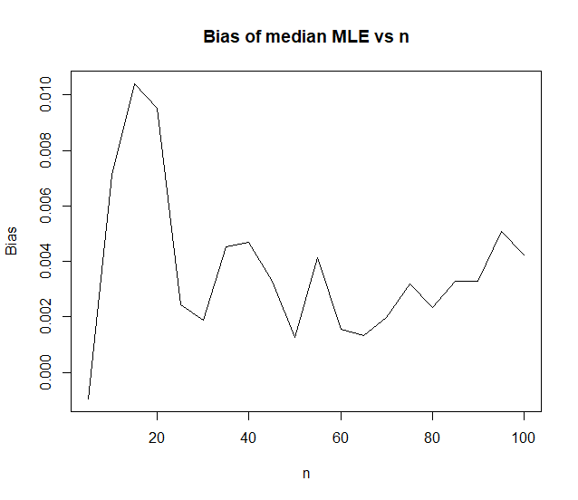
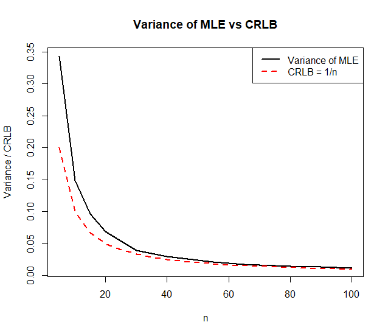
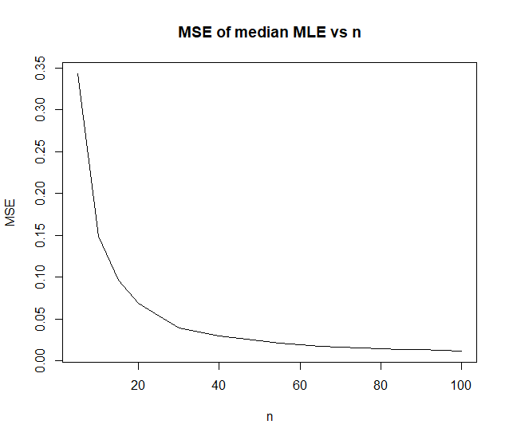

````markdown
# Laplace Distribution MLE Simulation in R

## Overview

This project studies the **maximum likelihood estimator (MLE)** for the location parameter \(\theta\) of a Laplace distribution using simulation methods in **R**.

The project includes:

- Simulating random samples from a Laplace distribution
- Computing the MLE of \(\theta\)
- Plotting the log-likelihood function
- Constructing confidence intervals
- Comparing asymptotic and likelihood-ratio intervals
- Evaluating bias, variance, MSE, and the Cramér–Rao lower bound (CRLB)
- Studying how estimator performance changes as sample size increases

---

# Distribution Used

The simulated data follows a **Laplace distribution** with:

- location parameter: \(\theta\)
- scale parameter: \(1\)

The probability density function is:

\[
f(x \mid \theta) = \frac{1}{2} e^{-|x-\theta|}
\]

---

# Project Structure

```text
laplace-mle-simulation/
│
├── laplace_mle_simulation.R
├── README.md
├── .gitignore
└── images/
    ├── loglikelihood_plot.png
    ├── bias_plot.png
    ├── variance_vs_crlb.png
    └── mse_plot.png
````

---

# Methods Used

## 1. Data Simulation

Random samples are generated using the **inverse transform method**.

* sample size per simulation: `n = 100`
* number of simulated samples: `m = 1000`

---

## 2. Maximum Likelihood Estimation

For the Laplace distribution, the MLE of (\theta) is the:

[
\hat{\theta} = \text{median}(X_1, X_2, ..., X_n)
]

The sample median is computed for each simulated dataset.

---

## 3. Log-Likelihood Function

The log-likelihood function is evaluated across a grid of (\theta) values to visualize where the maximum occurs.

### Log-Likelihood Plot


---

## 4. Confidence Intervals

Two different 90% confidence intervals are constructed:

### Asymptotic Normal Confidence Interval

Based on:

[
\hat{\theta} \sim N\left(\theta, \frac{1}{n}\right)
]

---

### Likelihood-Ratio Confidence Interval

Using the deviance statistic:

[
2(\ell(\hat{\theta}) - \ell(\theta))
]

and comparing it to a chi-square cutoff value.

---

# Simulation Study

The project investigates how estimator performance changes as the sample size increases.

The following quantities are studied:

* Bias
* Variance
* Mean Squared Error (MSE)
* Cramér–Rao Lower Bound (CRLB)

---

# Results and Visualizations

## Bias of the MLE


The bias remains close to zero across different sample sizes, showing that the sample median behaves approximately as an unbiased estimator.

---

## Variance vs CRLB


The variance decreases as the sample size increases and approaches the theoretical Cramér–Rao lower bound.

---

## Mean Squared Error (MSE)


The MSE decreases as the sample size increases, indicating improved estimator accuracy for larger samples.

---

# Key Findings

* The sample median performs well as the MLE for the Laplace location parameter.
* The estimator has very small bias.
* Variance and MSE decrease with increasing sample size.
* The estimator approaches the CRLB for large (n).
* Likelihood-ratio confidence intervals closely match asymptotic intervals in this simulation.

---

# Requirements

Install R from:

* [https://cran.r-project.org/](https://cran.r-project.org/)

Optional IDE:

* [https://posit.co/download/rstudio-desktop/](https://posit.co/download/rstudio-desktop/)

---

# Running the Project

Run the script in R or RStudio:

```r
source("laplace_mle_simulation.R")
```

The script will:

* generate simulated data
* compute estimators
* display confidence intervals
* generate plots

---

# Author

Created as part of a statistical simulation and estimation project using R.

```
```
